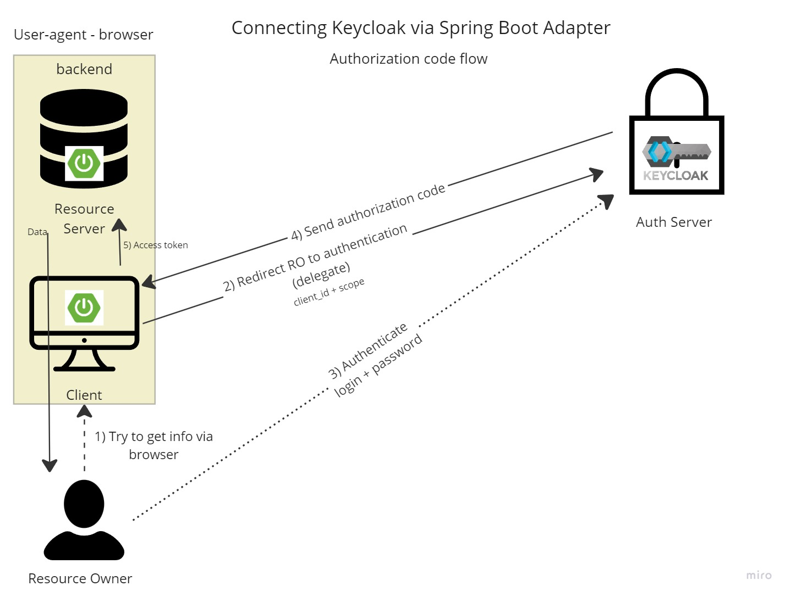

# spring-boot-keycloak
Using spring boot and Keycloak authorization server

[Article on Habr](https://habr.com/ru/companies/reksoft/articles/552346/) 

#### Keycloak setting
   1) Execute keycloak via docker-compose (standalone: keycloak + postgres)
    `docker-compose -f docker-compose.yml up` / `docker compose up -d`
   2) All settings will be imported from json configurations that placed in 'keycloak' module

##### Connecting to spring boot applications
   1) ##### Connecting Keycloak via Spring Boot Adapter
      > Connect to auth-server (keycloak) via adapter.
      > 
      > Application dependent on implementation
      
      1) `mvn clean install`
      2) `java -jar target/demo-keycloak-adapter-0.0.1-SNAPSHOT.jar`
      3) Interaction scheme :
         

   2) ##### Using OAuth2 Client from spring-security
      > Connect to auth-server (keycloak) via OAuth2 client from spring security.
      >
      > Application isn't dependent on implementation
   
      1) `mvn clean install`
      2) `java -jar target/demo-keycloak-adapter-0.0.1-SNAPSHOT.jar`

   3) ##### We connect the application as a ResourceService
      > Connecting the application as a ResourceService. User authorization checks based on the provided access token. Only authorization, without authentication + user token validation.
   
      1) `mvn clean install`
      2) `java -jar target/demo-keycloak-resource-0.0.1-SNAPSHOT.jar`

   4) ##### Service authorization using keycloak
      > Simulation of authorized calls between services (in microservice architecture) Using Client Credentials Flow.
      
      1) `mvn clean install`
      2) `java -jar target/demo-service-auth-0.0.1-SNAPSHOT`
   